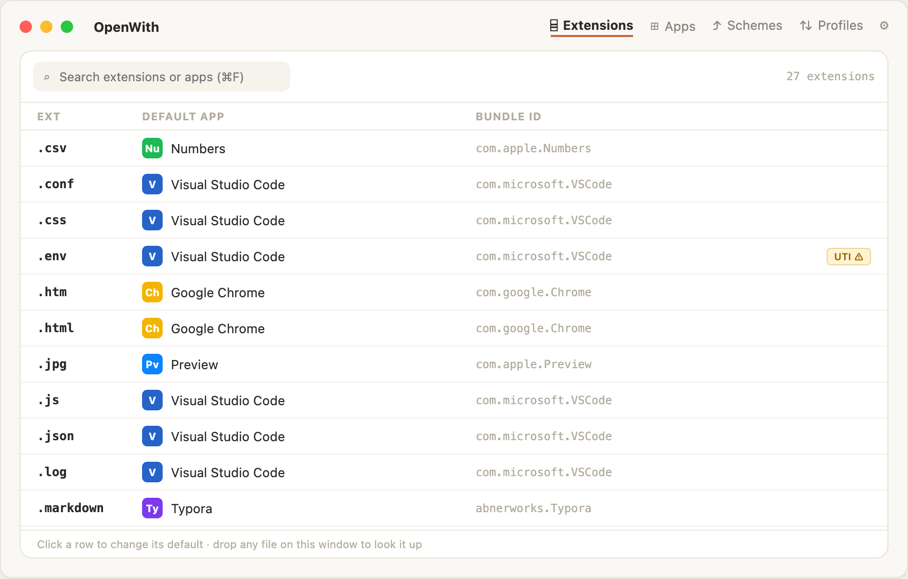
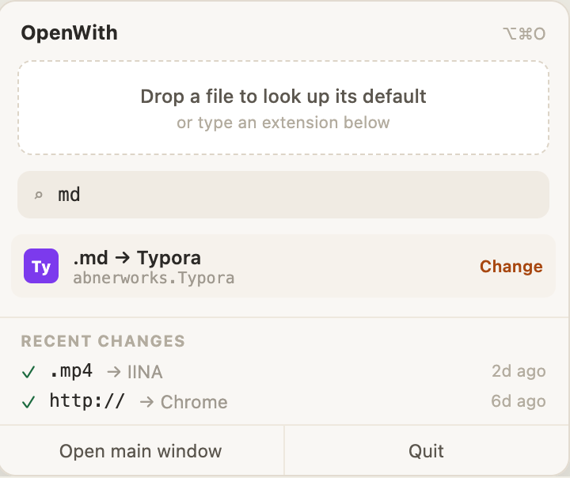

<p align="center">
  
</p>

<h1 align="center">OpenWith</h1>

<p align="center">
  Manage macOS "Open With" defaults from the terminal.
</p>

<p align="center">
  <a href="https://github.com/ColeMei/openwith/releases">Releases</a>
  ·
  <a href="LICENSE">License</a>
</p>

<p align="center">
  <a href="https://github.com/ColeMei/openwith/releases"></a>
  <a href="LICENSE"></a>
  
  
</p>

**OpenWith** is a small Rust-based macOS tool for inspecting and managing default apps for file types. It lets you see which app is currently set as the default for each file extension and update those associations from one place, without repetitive clicks or guessing bundle IDs. It ships as a terminal tool (CLI + interactive TUI) and a native GUI app, both driven by the same Rust core.

<p align="center">
  
</p>

<p align="center">
  
  
</p>


## Install

OpenWith ships in two flavors that share the same engine and change history — install either, or both:

- **`openwith` (formula)** — the `openwith` command: CLI plus interactive TUI. Pick this if you live in the terminal or want to script/dotfile your associations.
- **`openwith-gui` (cask)** — OpenWith.app: a native windowed app with a menu-bar popover. Pick this if you'd rather point and click.

### CLI / TUI

```bash
brew install ColeMei/openwith/openwith
```

If you prefer installing from source with Cargo, install Rust via [rustup](https://rustup.rs), then run:

```bash
cargo install --git https://github.com/ColeMei/openwith openwith-cli
```

For local development builds from this repository:

```bash
cargo install --path crates/openwith-cli
```

### GUI app

```bash
brew install --cask ColeMei/openwith/openwith-gui
```

Or download the `.dmg` from the [latest release](https://github.com/ColeMei/openwith/releases).

> [!IMPORTANT]
> The app is currently unsigned (no Apple Developer ID), so on first launch recent
> macOS versions claim **"OpenWith.app is damaged and can't be opened"**. It isn't —
> that's Gatekeeper's message for unsigned apps, and right-click → Open no longer
> bypasses it. Clear the quarantine flag once and it launches normally:
>
> ```bash
> xattr -dr com.apple.quarantine /Applications/OpenWith.app
> ```
>
> Or install without the quarantine flag in the first place:
>
> ```bash
> brew install --cask --no-quarantine ColeMei/openwith/openwith-gui
> ```

To build it from source instead: `cd crates/openwith-gui && npm install && npm run tauri build`.

> Installed the cask as `openwith` (pre-v0.5.2)? It was renamed: `brew uninstall --cask openwith && brew install --cask ColeMei/openwith/openwith-gui`.

## Quick Start

```bash
openwith                    # Launch interactive TUI (extensions view)
openwith list               # Same as above
openwith apps               # Launch interactive TUI (apps view)
openwith current pdf        # Show default app for .pdf
openwith set md Typora      # Set Typora as default for .md
openwith set md abnerworks.Typora  # Bundle IDs work too
openwith current -s http    # Show the default browser
openwith set -s http Firefox      # Set the default browser
openwith history            # Recent changes (recorded by CLI and GUI alike)
openwith undo               # Revert the most recent change
```

Run `openwith --help` to see all commands.

### Interactive TUI

Run `openwith` with no arguments to browse all file extensions, see their current defaults, and change them interactively. The TUI has two tabs you can switch between with `Tab`:

- **Extensions** — browse all file extensions, see their current default app, and change defaults via an app picker
- **Apps** — browse all installed apps in a master-detail view, see which extensions each app supports and which it's the default for

Press `?` inside the TUI for keyboard shortcuts.

### Export & Import

You can export your current associations to a TOML file and import them on another machine — making your "Open With" preferences portable, like a dotfile.

```bash
openwith export -o openwith.toml    # Export
openwith import --dry-run openwith.toml  # Preview what would change
openwith import openwith.toml       # Import on a new machine
```

The export includes a `[schemes]` table for URL handlers (browser, mail client). Import is idempotent: associations already set correctly are left untouched, apps that aren't installed are skipped, and every change reports what it replaced — so the same config works across machines with different setups and is safe to run from a dotfiles script.

### Scripting

`openwith list` prints a plain table instead of launching the TUI when its output is piped, and `--plain` / `--json` force either format:

```bash
openwith list --json | jq -r '.[] | select(.app == "Preview") | .ext'
openwith current pdf --json
```

### Shell completions

```bash
openwith completions zsh > "${fpath[1]}/_openwith"   # zsh
openwith completions bash > $(brew --prefix)/etc/bash_completion.d/openwith
openwith completions fish > ~/.config/fish/completions/openwith.fish
```

## How It Works

1. Scans `/Applications`, `/System/Applications`, and `~/Applications` for `.app` bundles
2. Reads each app's `Info.plist` to discover supported file extensions and URL schemes
3. Queries and sets defaults via native macOS Launch Services APIs

## Caveats

- **macOS associates defaults with file *types* (UTIs), not extensions.** Some extensions share a type: `.env` resolves to `public.plain-text`, the same type as `.txt`, so changing one changes the other. `openwith` warns you and lists the affected sibling extensions whenever this happens.
- Finder occasionally caches icons/defaults; if a change doesn't appear immediately, relaunch Finder or log out and back in. The association itself is applied instantly.

## License

MIT

## Acknowledgement

Special thanks to [linux.do](https://linux.do)
